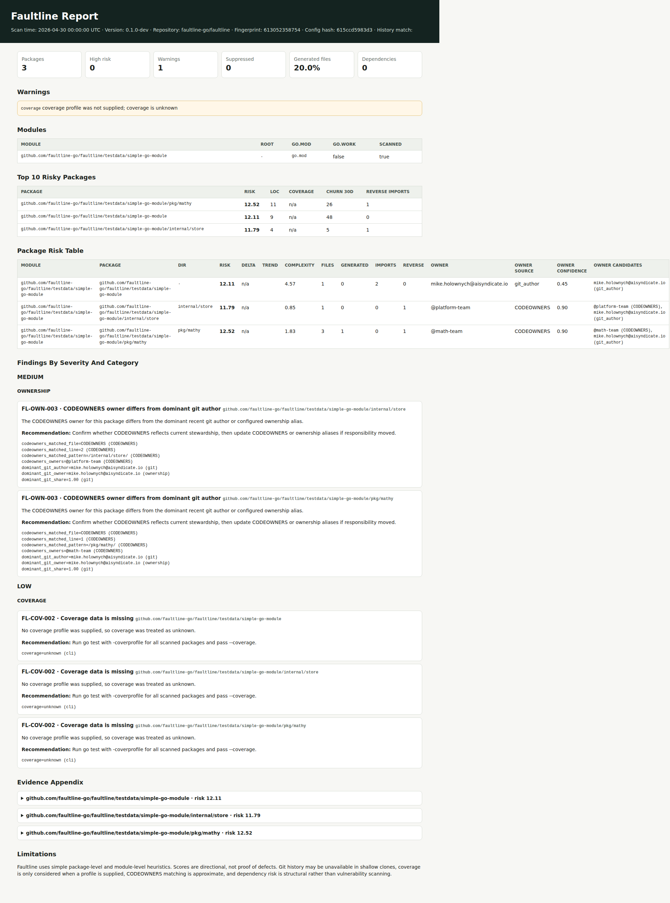

# Faultline

[](https://github.com/faultline-go/faultline/actions/workflows/ci.yml)
[](https://github.com/faultline-go/faultline/actions/workflows/release.yml)
[](LICENSE)
[](https://pkg.go.dev/github.com/faultline-go/faultline)

**Local-first structural risk analysis for Go codebases.**

Faultline scans Go repositories and produces explainable package-level risk reports from code structure, git history, ownership, coverage, dependency metadata, and architecture policy inputs. It is built for teams that need to find technical-debt hotspots before they become incidents, without sending source code to a hosted service.

```sh
go install github.com/faultline-go/faultline/cmd/faultline@latest
faultline scan ./... --format html --out faultline-report.html
```



Faultline is local-first. It does not upload source code, run a server, execute repository scripts, or require runtime network access. Reports can be generated as HTML, JSON, SARIF for GitHub code scanning, or a metadata-only snapshot for portfolio governance.

## Why Teams Use It

- **Find structural risk early:** combine churn, coverage, ownership, dependencies, centrality, and policy drift into one package-level signal.
- **Keep analysis explainable:** every score includes evidence so teams can see why a package is risky.
- **Stay local by default:** scan in a developer shell or CI without uploading source code.
- **Bridge to governance:** export `faultline.snapshot.v1` metadata for dashboards and audit workflows while keeping code private.

Try a bundled sample:

```sh
go build -o bin/faultline ./cmd/faultline
cd testdata/simple-go-module
../../bin/faultline scan ./... --format html --out faultline-report.html --no-history
```

See [docs/demo.md](docs/demo.md) for example output and [examples/reports](examples/reports) for generated sample reports.

Faultline OSS is Apache 2.0 licensed. The public project is intended to stay genuinely useful for local and CI workflows; paid products should monetize organization-wide governance and automation rather than cripple local scanning.

## What Faultline Is

- A local CLI for package-level Go risk reports.
- A way to surface packages with high churn, low coverage, unclear ownership, high centrality, or generated-code-heavy metrics.
- A metadata producer for optional hosted governance, audit, and portfolio reporting.

## What Faultline Is Not

- It is not a vulnerability scanner.
- It is not a SaaS backend.
- It is not a dashboard.
- It is not a replacement for tests, code review, or architecture ownership.

## Open-Core Boundary

Faultline's OSS core includes the scanner engine, local HTML/JSON/SARIF/snapshot reports, PR markdown output, local baselines, local SQLite history, config governance, suppressions audit, local rule packs, dependency findings, boundary findings, ownership findings, and multi-module scanning.

Commercial Faultline products should be additive: multi-repo dashboards, centralized policy packs, suppression approval workflows, SSO/RBAC, Slack/Jira automation, portfolio trends, audit exports, and managed onboarding. The scanner, SARIF, PR markdown, local reports, local trends, baselines, and config policy engine must remain usable without login.

The public integration contract for paid systems is metadata-only: `faultline scan --format snapshot` emits `faultline.snapshot.v1`, a source-free upload contract. See [docs/open-core.md](docs/open-core.md) and [docs/export-contracts.md](docs/export-contracts.md).

## MCP and Agent Skills

Faultline Enterprise exposes optional agent integrations for teams that want AI
assistants to query portfolio governance data without uploading source code.
The OSS scanner remains local-first; agents work from Enterprise metadata such
as snapshot summaries, risk scores, finding codes, suppressions, policy packs,
and audit events.

- MCP endpoint: `https://mcp.gofaultline.dev/mcp`
- MCP docs: `https://docs.gofaultline.dev/mcp/`
- Agent Skills discovery: `https://skills.gofaultline.dev/llms.txt`
- Faultline skill manifest:
  `https://skills.gofaultline.dev/faultline/SKILL.md`

Utility MCP tools such as `faultline_explain_finding` and
`faultline_explain_score` require no authentication. Enterprise data tools
require a Faultline API token from `app.gofaultline.dev` and operate against
metadata-only org/repo records.

## Installation

Install from source with Go:

```sh
go install github.com/faultline-go/faultline/cmd/faultline@latest
faultline version
```

Install from a release archive:

```sh
# Pick the archive for your OS and architecture from GitHub Releases.
curl -L -o faultline.tar.gz https://github.com/faultline-go/faultline/releases/download/v0.1.0/faultline_v0.1.0_linux_amd64.tar.gz
curl -L -o checksums.txt https://github.com/faultline-go/faultline/releases/download/v0.1.0/checksums.txt
sha256sum --check --ignore-missing checksums.txt
tar -xzf faultline.tar.gz
install -m 0755 faultline /usr/local/bin/faultline
faultline version
```

On macOS, use `shasum -a 256 -c checksums.txt` if `sha256sum` is unavailable. On Windows, download the `.zip` archive and verify the SHA-256 hash with `Get-FileHash`.

Install with Homebrew after the tap is published:

```sh
brew tap faultline-go/tap
brew install --cask faultline
faultline version
```

Run with Docker:

```sh
docker run --rm ghcr.io/faultline-go/faultline:latest version
docker run --rm -v "$PWD:/workspace" -w /workspace ghcr.io/faultline-go/faultline:latest scan ./... --format html --out faultline-report.html
```

The container includes Go and git so package loading and history analysis work in CI. Local history under `.faultline/` is written inside the mounted repository only when that mount is writable; otherwise history degrades to report warnings.

Run a first local scan:

```sh
faultline scan ./... --format html --out faultline-report.html
```

Create a source-free enterprise snapshot:

```sh
faultline scan ./... --format snapshot --out faultline-snapshot.json
```

## Verifying Releases

Faultline release artifacts are designed to be checked in layers:

- `checksums.txt` verifies file integrity.
- `checksums.txt.sig` and `checksums.txt.pem` verify checksum authenticity with Cosign keyless signing.
- GitHub artifact attestations link artifacts to the release workflow.
- SPDX JSON SBOM files describe packaged contents and dependencies.

Example verification:

```sh
sha256sum --check --ignore-missing checksums.txt
cosign verify-blob checksums.txt \
  --signature checksums.txt.sig \
  --certificate checksums.txt.pem \
  --certificate-identity-regexp 'https://github.com/faultline-go/faultline/.github/workflows/release.yml@refs/tags/v.*' \
  --certificate-oidc-issuer https://token.actions.githubusercontent.com
gh attestation verify faultline_vX.Y.Z_linux_amd64.tar.gz --repo faultline-go/faultline
```

SBOMs are SPDX JSON files named beside release archives, for example `faultline_vX.Y.Z_linux_amd64.tar.gz.spdx.json`.

For local development:

```sh
make build
bin/faultline version
make quality
```

`make quality` runs the repository's parity gate for formatting, module tidy
state, tests, `golangci-lint`, and the Go team's `deadcode` analyzer. See
[docs/tool-parity.md](docs/tool-parity.md) for the full mapping between
Faultline's native signals and delegated Go static-analysis tools.

## Contributing and Security

Faultline accepts contributions under Apache 2.0 with Developer Certificate of Origin sign-off:

```sh
git commit -s
```

Useful first contributions include noisy finding reports, sample configs from real
Go monorepos, docs fixes, and small scanner edge cases. Use the `Noisy finding`
issue template when a report is technically correct but not useful.

See [CONTRIBUTING.md](CONTRIBUTING.md) for contribution guidance and [SECURITY.md](SECURITY.md) for vulnerability reporting. The Faultline name and marks are not licensed by Apache 2.0; see [NOTICE](NOTICE).

## Usage

```sh
faultline scan ./... --format html --out faultline-report.html
faultline scan ./... --format json --out faultline-report.json
faultline scan ./... --format sarif --out faultline.sarif
faultline scan ./... --format snapshot --out faultline-snapshot.json
```

Use `--format snapshot` for the metadata-only `faultline.snapshot.v1` upload
contract. Use `--format json` for the local developer report.

By default, scans are stored locally in `.faultline/faultline.db` so later reports can show risk trends. Disable this with:

```sh
faultline scan ./... --no-history --format html --out faultline-report.html
```

With coverage:

```sh
go test ./... -coverprofile=coverage.out
faultline scan ./... --coverage coverage.out --format html --out faultline-report.html
```

With build tags and exclusions:

```sh
faultline scan ./... --tags integration,linux --exclude "testdata/..." --format json --out report.json
```

## Multi-Module Repositories

Faultline discovers all `go.mod` files under the repository root while skipping `vendor/`, `third_party/`, `node_modules/`, and `.git/`. When a root `go.work` exists, reports show which modules are included by the workspace.

Default behavior:

- Running from the repository root scans all discovered modules.
- Running from inside one module scans that module.
- `--all-modules` scans every discovered module even when invoked from inside one module.

Module selection:

```sh
faultline scan ./... --all-modules --format html --out faultline-report.html
faultline scan ./... --module service-a --format json --out service-a-report.json
faultline scan ./... --module example.com/org/service-a --ignore-module shared --format json --out report.json
```

Reports include a `modules` array with module path, module root, `go.mod` path, go.work inclusion, and selected status. Package records include `module_path` and `module_root`, and dependency inventory is grouped by source module. Cross-module local replaces inside the repository emit `FL-DEP-007`.

Current monorepo limitations:

- Package loading is module-oriented; unusual package patterns outside selected module roots may need explicit module selection.
- `go.work` is detected at the repository root.
- PR review changed-package detection handles module boundaries, but dependency impact remains package/import based rather than full module graph impact.

## Ownership Resolution

Faultline resolves package ownership from several local signals using deterministic precedence:

1. explicit module owner from `owners.modules`
2. CODEOWNERS match
3. dominant recent git author mapped through `owners.aliases`
4. dominant recent git author as a low-confidence fallback
5. unknown

Example:

```yaml
owners:
  aliases:
    "@payments-platform":
      - "alice@example.com"
      - "bob@example.com"
      - "@github-team/payments"
  modules:
    "github.com/acme/service-a":
      owner: "@service-a-team"
    "github.com/acme/shared":
      owner: "@platform-team"
```

Reports include the selected owner, owner source, candidate owners, confidence, and evidence for each ownership source. In multi-module repositories, add an `owners.modules` entry for each module so package ownership remains stable when module paths or directories move.

Faultline keeps package ownership and file ownership separate:

- Package ownership is used for package risk reports and scoring evidence.
- File ownership is used where exact file context matters: changed-file PR review summaries, boundary violations, and SARIF results with exact file locations.

Ownership findings:

- `FL-OWN-001`: no owner found.
- `FL-OWN-002`: high author count in the last 90 days.
- `FL-OWN-003`: CODEOWNERS owner differs from dominant git author or alias.
- `FL-OWN-004`: module owner missing in a multi-module repository.

Git authorship is an inference signal, not authority. Use aliases to map emails and external team handles to canonical owner teams, and prefer explicit module owners or CODEOWNERS for enforcement.

### CODEOWNERS Compatibility

Faultline reads the first CODEOWNERS file found using GitHub's location precedence:

1. `.github/CODEOWNERS`
2. `CODEOWNERS`
3. `docs/CODEOWNERS`

Within that file, the last matching rule wins. Faultline supports comments, blank lines, multiple owners, escaped spaces in patterns where practical, directory patterns ending in `/`, root-anchored patterns starting with `/`, and common wildcard patterns.

Ownership evidence includes the matched CODEOWNERS file, line number, pattern, and owners from the selected rule. Boundary findings also include file-level owner evidence for the importing file when Faultline can locate the import. PR reviews summarize changed files with owners, changed files without owners, and mismatches between exact file owners and the selected package owner. CODEOWNERS diagnostics are warnings by default and include malformed rules, rules without owners, unsupported patterns, and owner tokens that are neither `@`-prefixed nor email-like. With `--strict-config`, CODEOWNERS diagnostics fail scans and PR reviews when a CODEOWNERS file is used.

Known compatibility deviations:

- Faultline warns on unsupported GitHub CODEOWNERS constructs such as `!` negation and character ranges instead of treating them as authoritative policy.
- Matching is intentionally approximate and package-oriented; GitHub evaluates ownership at file paths.
- CODEOWNERS is governance evidence, not proof that the listed team is currently accountable.

Dependency inventory is included automatically for module repositories by reading local `go.mod` and `go.sum` only. Faultline does not call the module proxy, run `go get`, mutate module files, or query vulnerability databases during default scans.

Optional `govulncheck` integration is off by default:

```sh
faultline scan ./... --format json --out faultline-report.json --govulncheck off
faultline scan ./... --format json --out faultline-report.json --govulncheck auto
faultline scan ./... --format json --out faultline-report.json --govulncheck /path/to/govulncheck
```

When enabled, `govulncheck` output is labeled as external tool output. Faultline treats unavailable or failing `govulncheck` runs as warnings so structural reports still complete.

## Configuration Governance

`faultline.yaml` can be validated and explained before it is used as a CI enforcement artifact:

```sh
faultline config validate --config faultline.example.yaml
faultline config validate --config faultline.yaml --strict
faultline config explain --config faultline.yaml --format markdown
faultline config explain --config faultline.yaml --format json --out faultline-config.json
faultline config schema --format markdown --out faultline-config-schema.md
faultline config docs --config faultline.yaml --format markdown --out faultline-policy.md
faultline config resolved --config faultline.yaml --format yaml --out resolved.yaml
```

Validation checks supported config version, boundary rule shape, resolved `suppression_policy`, suppression required fields and expiry dates, ownership alias/module owner shape, threshold ranges, and unknown keys at the top level and under `ownership`, `owners`, `coverage`, `scoring`, `boundaries[]`, `suppression_policy`, and `suppressions[]`. Unknown keys are warnings by default. With `--strict`, ordinary validation warnings return exit code `1`; enforcement warnings such as nested unknown keys or suppression policy violations, parse errors, and unsupported versions return exit code `2`.

`config schema` generates the supported schema with field types, required status, defaults, validation rules, and examples. `config docs` generates human-readable governance documentation from a specific `faultline.yaml`, including grouped suppressions and a strict-mode readiness summary.

See [docs/config-examples.md](docs/config-examples.md) for sanitized `faultline.yaml` starting points for single-service repositories, multi-module monorepos, CODEOWNERS-heavy repositories, and architecture boundary enforcement.

Scans, baselines, and PR reviews can fail fast on config warnings by using `--strict-config`:

```sh
faultline scan ./... --config faultline.yaml --strict-config --format json --out faultline-report.json
faultline baseline check --baseline faultline-baseline.json --config faultline.yaml --strict-config
faultline pr review --config faultline.yaml --strict-config --comment-out review.md
```

Suppression audits show whether waivers are active, expired, expiring within 30 days, incomplete, policy-violating, or not matching any current finding:

```sh
faultline suppressions audit --config faultline.yaml --format markdown
faultline suppressions audit --config faultline.yaml --format json --out faultline-suppressions.json
```

Config explanations and scan outputs include the config hash so CI artifacts can be tied back to the exact policy input.

### Rule Packs

Rule packs let organizations reuse versioned local governance policy across repositories:

```yaml
version: 1

rule_packs:
  - path: .faultline/rules/platform.yaml
  - path: .faultline/rules/payments.yaml

coverage:
  min_package_coverage: 75

suppressions:
  - id: FL-BND-001
    category: BOUNDARY
    package: "*/internal/legacy/*"
    reason: "Repo-owned migration waiver"
    owner: "@payments"
    created: "2026-04-01"
    expires: "2026-06-30"
```

Rule packs may define `ownership`, `owners`, `coverage`, `scoring`, `boundaries`, and `suppression_policy`. Suppressions are intentionally repo-local and are ignored with a warning if placed inside a rule pack.

Rule-pack suppression policy is enforced against repo-local suppressions after all imports are resolved:

```yaml
suppression_policy:
  require_owner: true
  require_reason: true
  require_expiry: true
  max_days: 90
```

`created` is optional on each suppression. When present, `max_days` is measured from `created`; otherwise Faultline uses the scan or validation date. In non-strict mode, policy-violating suppressions are reported and may still apply. With `--strict-config`, suppression policy warnings fail scans, baseline checks, and PR reviews with exit code `2`.

Merge precedence is deterministic:

- Rule packs are processed in listed order.
- Later rule packs override earlier scalar settings.
- Repo-local `faultline.yaml` overrides imported scalar settings.
- Boundaries are appended and de-duplicated by `name`; non-identical duplicates warn and the later rule wins.
- Repo-local suppressions apply after the full policy is resolved.

Rule pack paths are local files only. Faultline does not fetch rule packs from the network, expand environment variables, execute commands, or read remote registries. By default, rule pack paths must stay inside the repository root and symlinks that escape the repository are rejected. Use `--allow-config-outside-repo` only for explicitly trusted local policy layouts.

## Baseline Governance

Baselines let teams ratchet risk down without failing CI on existing debt. Create a source-free snapshot from an accepted scan:

```sh
faultline baseline create --out faultline-baseline.json
```

Then check future scans against it:

```sh
faultline baseline check --baseline faultline-baseline.json --fail-on-new high
faultline baseline check --baseline faultline-baseline.json --fail-on-new high --fail-on-risk-delta 10 --format markdown --out faultline-baseline-check.md
```

Baseline files store scan metadata, repository fingerprint, config hash, package risk scores, finding identities, active suppressions, and summary counts. They do not store source code or file contents.

Finding identity is based on finding ID, package import path, category, stable evidence key/value pairs, boundary denied import evidence when present, and package-level location metadata. Suppressed findings remain visible in baseline check output, but they do not trigger `--fail-on-new`.

A typical ratcheting workflow:

1. Review the current report and fix urgent issues.
2. Create `faultline-baseline.json` from the accepted state.
3. Check the baseline file into the repo or store it as a governed CI artifact.
4. Run `baseline check` in CI to fail only on new unsuppressed findings or configured risk deltas.
5. Periodically regenerate the baseline only after reviewing resolved debt and remaining waivers.

Baselines are governance waivers, not proof of safety. They preserve known risk so teams can improve it deliberately.

Example CI baseline gate:

```yaml
name: Faultline Baseline

on: [pull_request]

jobs:
  baseline:
    runs-on: ubuntu-latest
    steps:
      - uses: actions/checkout@v6
        with:
          fetch-depth: 0
      - uses: actions/setup-go@v6
        with:
          go-version: stable
      - run: go install github.com/faultline-go/faultline/cmd/faultline@latest
      - run: faultline baseline check --baseline faultline-baseline.json --fail-on-new high --fail-on-risk-delta 10 --format markdown --out faultline-baseline-check.md
      - uses: actions/upload-artifact@v7
        if: always()
        with:
          name: faultline-baseline-check
          path: faultline-baseline-check.md
```

For a pull request review comment generated locally:

```sh
faultline pr review --base origin/main --head HEAD --compare-mode auto --comment-out faultline-pr-review.md
```

To post or update a GitHub pull request comment in CI:

```sh
faultline pr review --post --compare-mode auto --fail-on high
```

With architecture boundaries:

```yaml
version: 1

boundaries:
  - name: handlers-must-not-import-storage
    from: "*/internal/handlers/*"
    deny:
      - "*/internal/storage/*"
    except:
      - "*/internal/storage/contracts"
```

Boundary rules match package import paths and package directories. A violation emits `FL-BND-001` with the importing package, denied import, rule name, and matched policy evidence.

Scoring calibration can be tuned in repo-local config or shared rule packs. Defaults preserve Faultline's initial risk model.

```yaml
scoring:
  churn_max_lines_30d: 1000
  complexity_max_loc: 1000
  complexity_max_imports: 20
  complexity_max_files: 30
  dependency_centrality_max_reverse_imports: 10
```

Suppressions are waivers, not deletions. Suppressed findings remain in package findings and in the top-level suppression audit, but they do not trigger `--fail-on`.

```yaml
suppression_policy:
  require_owner: true
  require_reason: true
  require_expiry: true
  max_days: 90

suppressions:
  - id: FL-BND-001
    category: BOUNDARY
    package: "*/internal/handlers/*"
    reason: "Temporary migration while storage interface is extracted"
    owner: "@platform-team"
    created: "2026-04-30"
    expires: "2026-07-29"
```

Useful flags:

- `--format html|json|sarif`
- `--out <path>`
- `--coverage <coverage.out>`
- `--config <faultline.yaml>`
- `--tags <comma-separated build tags>`
- `--fail-on none|high|critical`
- `--include-generated`
- `--exclude <glob>` repeatable
- `--strict-config`
- `--no-history`
- `--verbose`

## Local History

Faultline persists scan metadata, package metrics, findings, warnings, and suppression metadata in SQLite at `.faultline/faultline.db`. It uses a pure-Go SQLite driver, so CGO and native SQLite toolchains are not required.

It does not store source code, full file contents, or remote telemetry. History rows include only metrics and finding metadata.

Trend fields compare the current scan to the most recent previous scan for the same repository identity:

- `previous_risk_score`
- `risk_delta`
- `trend`: `NEW`, `IMPROVED`, `WORSENED`, or `UNCHANGED`

Inspect local history:

```sh
faultline history list
faultline history show <scan-id>
faultline history prune --before 2026-01-01
faultline history doctor
```

### Repository Fingerprints

Faultline stores a stable `repo_fingerprint` and display name with each scan so history can follow a repository across moved directories, CI workspaces, and containers.

Fingerprint inputs, in priority order:

1. Normalized `git remote origin` URL, git top-level directory name, and default/current branch when available.
2. `go.mod` module path plus repository basename.
3. Sorted scanned package import roots plus repository basename.

The fingerprint is a SHA-256 hash of those local metadata fields. Remote URLs are normalized before hashing, and source code is not included.

`.faultline/` should usually be gitignored:

```gitignore
.faultline/
```

## Exit Codes

- `0`: scan completed; no configured failure threshold was reached.
- `1`: scan or baseline check completed, and a configured threshold matched unsuppressed findings or risk deltas.
- `2`: execution or configuration error.

Defaults are CI-safe: scans do not fail builds unless `--fail-on` is explicitly set.

## Risk Model Summary

Faultline reports normalized 0-100 component scores and a weighted total:

```text
risk_score =
  churn_score * 0.25 +
  coverage_gap_score * 0.20 +
  complexity_score * 0.20 +
  ownership_entropy_score * 0.20 +
  dependency_centrality_score * 0.15
```

Every package includes score evidence. Findings include category, severity, evidence, recommendation, and confidence.

Boundary findings are policy findings and are not currently folded into the numeric risk score. Use `--fail-on high` to make unsuppressed boundary violations fail CI.

Dependency findings are also separate from the numeric package risk score. They are structural module-governance signals from `go.mod`, `go.sum`, and the loaded import graph:

- `FL-DEP-002`: local `replace` directive present.
- `FL-DEP-003`: module replaced to a different module path.
- `FL-DEP-004`: direct dependency appears unused, best-effort.
- `FL-DEP-005`: dependency has broad import blast radius.
- `FL-DEP-006`: dependency version is a Go pseudo-version.
- `FL-DEP-007`: local replace points to another module in the same repository.

Faultline dependency risk is not CVE scanning. Use `--govulncheck auto` or a pinned `--govulncheck /path/to/govulncheck` only when you want optional external vulnerability tool output included.

## Privacy And Security

Source code and scan data stay in the local environment. Faultline only invokes read-only git commands for history analysis and reads local Go module files for dependency inventory. Default scans do not call module proxies, vulnerability databases, or remote services. Local history stores metrics and finding metadata, not source code. Missing git, shallow clones, missing coverage, unavailable history storage, and unavailable optional `govulncheck` degrade to warnings instead of failing the scan.

## GitHub Action

The easiest way to run Faultline in CI:

```yaml
- uses: actions/checkout@v4
  with:
    fetch-depth: 0
- uses: faultline-go/action@v1
```

See [github.com/faultline-go/action](https://github.com/faultline-go/action)
for all options including Enterprise snapshot upload, coverage integration,
and architecture boundary enforcement.

## Docker GitHub Action

```yaml
name: faultline-container

on: [pull_request]

jobs:
  scan:
    runs-on: ubuntu-latest
    steps:
      - uses: actions/checkout@v6
        with:
          fetch-depth: 0
      - run: |
          docker run --rm \
            -v "$PWD:/workspace" \
            -w /workspace \
            ghcr.io/faultline-go/faultline:latest \
            scan ./... --format json --out faultline-report.json --fail-on high
      - uses: actions/upload-artifact@v7
        if: always()
        with:
          name: faultline-report
          path: faultline-report.json
```

## GitHub Code Scanning SARIF

```yaml
name: Faultline SARIF

on:
  pull_request:
  push:
    branches: [main]

jobs:
  faultline:
    runs-on: ubuntu-latest
    permissions:
      security-events: write
      contents: read
    steps:
      - uses: actions/checkout@v6
        with:
          fetch-depth: 0

      - uses: actions/setup-go@v6
        with:
          go-version: stable

      - run: go test ./... -coverprofile=coverage.out

      - run: faultline scan ./... --coverage coverage.out --format sarif --out faultline.sarif

      - uses: github/codeql-action/upload-sarif@v3
        with:
          sarif_file: faultline.sarif
```

## Pull Request Risk Reviews

`faultline pr review` compares changed Go packages and one-hop impacted packages against the configured base ref, with local history as a fallback. It renders a concise markdown review containing changed packages, impacted packages, new unsuppressed findings, resolved findings, worst risk delta, and reviewer guidance.

The command uses `git diff --name-only <base>...<head>` and can run without GitHub environment variables:

```sh
faultline pr review --base origin/main --head HEAD --compare-mode auto --comment-out faultline-pr-review.md
```

You can also compare arbitrary refs without checking them out:

```sh
faultline pr review --base origin/main --head feature/foo --compare-mode worktree --comment-out review.md
```

Comparison modes:

- `--compare-mode auto`: default. Uses temporary detached git worktrees for available refs, then falls back to local history for the base comparison with a warning.
- `--compare-mode worktree`: requires base-ref worktree comparison. If the base ref cannot be scanned, the command exits with code `2`.
- `--compare-mode history`: uses the most recent local `.faultline/faultline.db` scan history for deltas and previous findings.

If `--head` is omitted or resolves to the caller's current `HEAD`, Faultline scans the caller worktree. If `--head` is an explicit different ref or SHA, Faultline creates a second detached worktree for that head ref. Invalid explicit head refs exit with code `2`; they do not silently degrade to the caller's `HEAD`.

Worktree comparison never checks out, resets, or removes the caller's working tree. Faultline runs:

```sh
git worktree add --detach <tempdir> <base-or-head-ref>
git worktree remove --force <tempdir>
```

Temporary base/head scans are not persisted into the caller's `.faultline/faultline.db`.

To produce inline GitHub code scanning annotations for only new unsuppressed PR findings, write PR SARIF and upload it from the workflow:

```sh
faultline pr review --base origin/main --head feature/foo --compare-mode worktree --sarif-out faultline-pr.sarif --comment-out review.md
```

When `--sarif-out` is used, the markdown review notes that inline annotations are available via uploaded SARIF. Faultline writes the SARIF file locally, but it does not upload SARIF itself.

When `--post` is supplied, Faultline uses `GITHUB_TOKEN`, repository, and PR number context to upsert a single comment marked with `<!-- faultline-pr-review -->`. If posting fails or no token is available, local markdown generation still works.

GitHub Actions should use `fetch-depth: 0` so `origin/main` or the detected base branch exists locally. With shallow checkout or missing base refs, `auto` mode falls back to history and reports the fallback reason in the comment.

Example workflow:

```yaml
name: Faultline PR Review

on:
  pull_request:

jobs:
  faultline:
    runs-on: ubuntu-latest
    permissions:
      security-events: write
      pull-requests: write
      contents: read
    steps:
      - uses: actions/checkout@v6
        with:
          fetch-depth: 0

      - uses: actions/setup-go@v6
        with:
          go-version: stable

      - run: go install github.com/faultline-go/faultline/cmd/faultline@latest

      - run: faultline pr review --compare-mode auto --sarif-out faultline-pr.sarif --comment-out review.md --post --fail-on high
        env:
          GITHUB_TOKEN: ${{ secrets.GITHUB_TOKEN }}

      - uses: github/codeql-action/upload-sarif@v3
        if: always()
        with:
          sarif_file: faultline-pr.sarif

      - uses: actions/upload-artifact@v7
        if: always()
        with:
          name: faultline-pr-review
          path: |
            review.md
            faultline-pr.sarif
```

## Current Limitations

- Scores are heuristic and directional, not proof of defects.
- Boundary policies support package import path and directory glob checks, but they do not yet model full architectural layers.
- Dependency risk is structural and local-only; it is not a replacement for vulnerability management.
- Suppressions are implemented as expiring waivers; they do not remove findings from reports.
- CODEOWNERS matching is approximate.
- Generated code is counted separately and excluded from LOC complexity by default, but generated-heavy packages still need human interpretation.
- GitHub App and hosted upload workflows are on the roadmap; the current OSS scanner is intentionally local-first and source-free.

## Governance Note

Suppressions should have an owner, reason, creation date, and expiry. Faultline enforces the resolved `suppression_policy`, warns on incomplete or overlong waiver entries, ignores expired suppressions, and keeps suppressed findings visible for review. For enterprise CI, keep `require_owner`, `require_reason`, and `require_expiry` enabled and set `max_days` to the maximum waiver duration your governance process allows.
